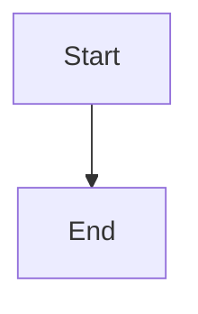

# Documentation Viewer Setup

## Overview

A polished documentation viewer has been set up using **MkDocs Material**. Your existing markdown files are rendered with professional navigation, search, and Mermaid diagram support.

## Quick Start

### 🚀 Easiest Way (Windows)

**Double-click: `📚 View Docs.bat`**

This will:
- ✅ Start the MkDocs server
- ✅ Automatically open your browser to http://127.0.0.1:8000
- ✅ Show the documentation viewer

### 📌 Create Desktop Shortcut (Windows)

Run `docs\create-desktop-shortcut.bat` once to create a "Cluiche Docs" icon on your desktop.

Then just double-click the desktop icon anytime!

### 🖱️ Silent Launch (Windows)

Double-click `docs\docs-launcher.vbs` to launch without showing the command window.

### 💻 Manual Start

#### Windows
```bash
docs\docs-serve.bat
```

#### Linux/Mac
```bash
./docs/docs-serve.sh
```

Then open your browser to: **http://127.0.0.1:8000**

## Features

✅ **Material Design Theme** - Professional, responsive layout with light/dark mode
✅ **Instant Search** - Full-text search with suggestions and highlighting
✅ **Mermaid Diagrams** - All 5 architecture diagrams render natively
✅ **Code Highlighting** - Syntax highlighting with copy buttons
✅ **Navigation** - Hierarchical sidebar matching your directory structure
✅ **Hot Reload** - Automatically refreshes when you edit markdown files

## Project Structure

```
C:\GitHub\Cluiche\
├── 📚 View Docs.bat            # ⭐ EASIEST: Click to launch
├── mkdocs.yml                  # MkDocs configuration (must be in root)
├── venv/                       # Python virtual environment (gitignored)
├── .mkdocs-site/               # Generated HTML (gitignored)
│
└── docs/                       # Documentation folder
    ├── *.md                    # Your markdown files
    ├── requirements.txt        # Python dependencies
    ├── DOCS_VIEWER.md          # This file
    ├── docs-launcher.vbs       # Silent launcher (no window)
    ├── create-desktop-shortcut.bat # Create desktop icon
    ├── docs-serve.bat          # Windows: Start server
    ├── docs-serve.sh           # Linux/Mac: Start server
    └── docs-build.bat          # Windows: Build static site
```

## Usage

### Start the Server

**Recommended:**
```bash
# Windows - Just double-click this file
📚 View Docs.bat
```

**Alternatives:**
```bash
# Windows (manual)
docs\docs-serve.bat

# Linux/Mac
./docs/docs-serve.sh

# Or via Python
venv\Scripts\activate
mkdocs serve
```

The server runs at **http://127.0.0.1:8000** and auto-reloads when files change.

### Build Static Site
```bash
# Windows
docs\docs-build.bat

# Or manually
venv\Scripts\activate
mkdocs build
```

Output is generated in `site/` directory.

### Stop the Server
Press `Ctrl+C` in the terminal where `mkdocs serve` is running.

## Authoring Workflow

**Nothing changes!** Continue editing your markdown files as before:

1. Edit any `.md` file in `docs/`
2. Save the file
3. Browser automatically refreshes with changes

### Adding New Files

1. Create your new `.md` file in `docs/`
2. Add it to the `nav` section in `mkdocs.yml`

Example:
```yaml
nav:
  - New Section:
    - My Page: path/to/my-page.md
```

### Mermaid Diagrams

Embed Mermaid diagrams directly in markdown:

````markdown

````

## Configuration

Edit `mkdocs.yml` to customize:
- Site name and description
- Navigation structure
- Theme colors (`primary` and `accent`)
- Features (search, navigation, etc.)
- Additional plugins

## Current Status

✅ **MkDocs Material 9.7.6** installed
✅ **Mermaid plugin** configured
✅ **Navigation structure** created for existing docs
✅ **5 Mermaid diagram wrappers** created in `docs/01-architecture/diagrams/`
✅ **Easy launchers** with auto-open browser
✅ **Server running** at http://127.0.0.1:8000

⚠️ **Warnings**: Some files referenced in nav don't exist yet (expected - docs are 72% complete per DOCUMENTATION_TODO.md). These files will appear in nav once created.

## Dependencies

All dependencies are in `docs/requirements.txt`:
- mkdocs>=1.5.0
- mkdocs-material>=9.5.0
- mkdocs-mermaid2-plugin>=1.1.0
- pymdown-extensions>=10.7.0

## Troubleshooting

### Virtual Environment Issues
```bash
# Recreate virtual environment
rm -rf venv
python -m venv venv
venv\Scripts\activate  # Windows
pip install -r docs\requirements.txt
```

### Port Already in Use
```bash
mkdocs serve -a 127.0.0.1:8001  # Use different port
```

### Broken Links
The warnings about missing files are expected - they reference documentation that hasn't been written yet (see DOCUMENTATION_TODO.md). They'll disappear as you complete the documentation.

## Launcher Files Explained

| File | Description |
|------|-------------|
| `📚 View Docs.bat` (root) | **Recommended** - Shows server status, auto-opens browser |
| `docs\docs-launcher.vbs` | Silent mode - no command window shown |
| `docs\create-desktop-shortcut.bat` | Creates desktop icon for one-click access |
| `docs\docs-serve.bat` | Basic server start (manual browser open) |
| `docs\docs-serve.sh` | Linux/Mac launcher |
| `docs\docs-build.bat` | Build static HTML files |

## Next Steps

1. ✅ **View your docs**: Double-click `📚 View Docs.bat`
2. ✅ **Test navigation**: Click through sections
3. ✅ **Test search**: Try searching for "ProcessingUnit"
4. ✅ **View diagrams**: Check `Architecture` → diagrams
5. ✅ **Test hot reload**: Edit a markdown file and watch it update
6. 📌 **Optional**: Run `docs\create-desktop-shortcut.bat` for desktop icon

## Notes

- **Localhost only**: This runs on your local machine only (not deployed)
- **Git**: `.mkdocs-site/` and `venv/` are gitignored
- **Source files**: Your original `.md` files are unchanged
- **Portable**: All files relative to repository root
- **Auto-browser**: The `📚 View Docs.bat` file automatically opens your browser
