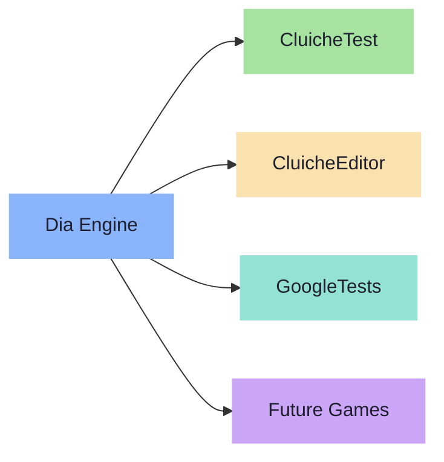

---
tags:
  - overview
---

# Cluiche Documentation

**Cluiche** is a game development platform built around the **Dia engine**.

| | | |
|:---:|:---:|:---:|
| **Learn** | **Build** | **Reference** |
| Understand architecture, design, and how the engine works. | Specs, development guides, and testing for active feature work. | Module registry, AI guides, API docs — look things up. |
| [Getting Started &rarr;](reference/getting-started/quickstart.md) | [Specs &rarr;](specs/README.md) | [Module Registry &rarr;](reference/registry/module-registry.md) |

---

## Quick Links

| | |
|---|---|
| **New to Cluiche?** | [Quickstart](reference/getting-started/quickstart.md) &rarr; [Architecture](reference/architecture/architecture.md) &rarr; [Design Philosophy](reference/design-rationale/design.md) |
| **Building a feature?** | [Specs Overview](specs/README.md) &rarr; [Contributing](reference/development/contributing.md) &rarr; [Coding Standards](reference/development/coding-standards.md) |
| **Debugging?** | [Debugging Tips](reference/development/debugging-tips.md) &middot; [Threading Model](reference/architecture/threading-model.md) &middot; [Known Issues](reference/development/known-issues.md) |
| **AI Agent?** | [AI Entry Point](reference/ai-guides/AI-README.md) &middot; [Codebase Map](reference/ai-guides/codebase-map.md) |

---

## Platform at a Glance

!!! tip "Backlog"
    Active work is tracked in the [Backlog](BACKLOG.md). Completed items in [History](BACKLOG-HISTORY.md).
