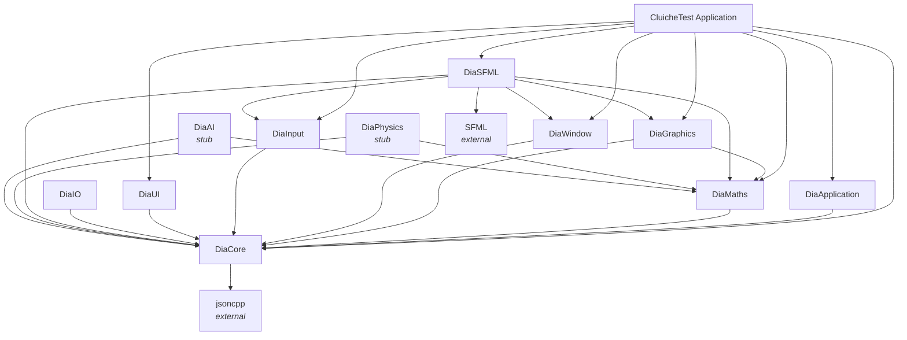

# Dependency Graph

**Last Updated:** 2026-04-01

Module and subsystem dependencies for AI agents to understand relationships.

---

## Overview

This document maps dependencies between subsystems and modules to help AI agents:
- Understand what depends on what
- Avoid circular dependencies
- Make informed decisions about where to add code

**Notation:**
- `A → B` means "A depends on B"
- `A ↛ B` means "A must NOT depend on B" (forbidden)

---

## Subsystem Dependencies

### Layer 1: Foundation

```
DiaCore
├── External: jsoncpp
└── No Dia dependencies
```

**DiaCore** is the foundation layer. All other Dia subsystems can depend on it.

---

### Layer 2: Platform Abstractions

```
DiaMaths
├── DiaCore
└── No other dependencies

DiaGraphics
├── DiaCore
├── DiaMaths
└── No other dependencies

DiaWindow
├── DiaCore
└── No other dependencies

DiaInput
├── DiaCore
└── No other dependencies

DiaUI
├── DiaCore
└── No other dependencies

DiaIO
├── DiaCore
└── No other dependencies
```

---

### Layer 3: Framework

```
DiaApplication
├── DiaCore
│   ├── Containers (DynamicArray, HashTable)
│   ├── Type (StringCRC, TypeRegistry)
│   ├── Architecture (Singleton, Observer)
│   └── Time (TimeServer, TimeAbsolute)
└── No other Dia dependencies
```

**DiaApplication** provides the application framework but doesn't depend on graphics, math, or other subsystems.

---

### Layer 4: Backend Implementations

```
DiaSFML
├── DiaCore
├── DiaMaths
├── DiaGraphics (implements ICanvas)
├── DiaWindow (implements IWindow)
├── DiaInput (translates to InputEvent)
└── External: SFML

```

---

### Layer 5: Specialized Subsystems (Stubs)

```
DiaPhysics
├── DiaCore
├── DiaMaths
└── (Stub implementation)

DiaAI
├── DiaCore
├── DiaMaths
└── (Stub implementation)
```

---

### Layer 6: Application

```
Cluiche
├── DiaApplication
│   ├── ProcessingUnit
│   ├── Phase
│   ├── Module
│   └── LevelFactory
├── DiaCore
│   ├── Containers
│   ├── Type
│   └── Utilities
├── DiaMaths
│   ├── Vector2D/3D
│   ├── Matrix33/44
│   └── Transform2D
├── DiaGraphics
│   └── ICanvas
├── DiaWindow
│   └── IWindow
├── DiaInput
│   └── InputEvent
├── DiaUI
│   └── IUISystem
└── DiaSFML
    ├── DiaSFMLRenderWindow
    └── DiaSFMLInputSource
```

---

## Full Dependency Graph



---

## Module Dependencies (CluicheTest Application)

### Main Thread Modules

```
MainKernelModule
└── No module dependencies

MainUIModule (ObserverSubject)
└── No module dependencies

LevelFactoryModule
└── DiaApplication::LevelFactory
```

### Sim Thread Modules

```
SimTimeServerModule
└── DiaCore::TimeServer

SimInputFrameStreamModule
├── MainProcessingUnit::GetInputFrameStream()
└── No module dependencies

SimUIProxyModule (Observer)
├── MainUIModule (observes)
└── DiaUI::IUISystem
```

### Module Dependency Graph

```
MainUIModule (Main thread)
    ↓ (observes via Observer pattern)
SimUIProxyModule (Sim thread)
    ↑ (sends messages via proxy)
```

```
MainProcessingUnit::mInputFrameStream
    ↓ (writes input events)
    ↓
SimInputFrameStreamModule (Sim thread)
    ↓ (reads input events)
```

**No Circular Dependencies:** Module system prevents cycles via topological sort.

---

## Threading Dependencies

### Thread Communication

```
Main Thread
    ↓ (FrameStream: InputEvent)
Sim Thread

Main Thread
    ↑ (Observer: UI ready notification)
Sim Thread

Render Thread
    ↔ (FrameStream: RenderCommands - future)
Sim Thread
```

### Thread Synchronization

```
ProcessingUnit Phase Transitions
    → Uses std::mutex

ObserverSubject::Notify()
    → Uses std::mutex

FrameStream::Read()/Write()
    → Uses std::mutex

Random::RandomFloat()
    → Uses std::mutex (fixed 2026-03)
```

---

## Forbidden Dependencies

### Layer Violations

**❌ DiaCore cannot depend on:**
- DiaApplication (higher layer)
- DiaMaths (peer layer)
- DiaGraphics (peer layer)
- Any application code

**❌ DiaMaths cannot depend on:**
- DiaGraphics (separation of concerns)
- DiaApplication (layer violation)
- DiaSFML (backend dependency)

**❌ DiaGraphics cannot depend on:**
- DiaSFML (abstraction must not depend on implementation)
- DiaApplication (layer violation)

**❌ DiaApplication cannot depend on:**
- Cluiche (engine must not know application)
- DiaSFML (backend dependency)
- DiaGraphics (optional subsystem)

### Abstraction Violations

**❌ Cluiche cannot depend on:**
- SFML directly (must use DiaSFML)

**❌ DiaSFML cannot depend on:**
- Cluiche (backend doesn't know application)

---

## Dependency Analysis Tool

### Using dia_modules.py

**Validate Dependencies:**
```bash
python Tools/dia_modules.py --validate
```

**Generate Dependency Graph:**
```bash
python Tools/dia_modules.py --graph output.dot
```

**Find Circular Dependencies:**
```bash
python Tools/dia_modules.py --check-cycles
```

**List Module Dependencies:**
```bash
python Tools/dia_modules.py --list dia.core.containers
```

---

## Adding Dependencies Safely

### Step 1: Check Layering

**Question:** Is this dependency allowed by layer rules?

```
Lower layers ← Higher layers (OK)
Lower layers → Higher layers (FORBIDDEN)
```

**Example:**
- ✅ Cluiche → DiaCore (OK, higher → lower)
- ❌ DiaCore → Cluiche (FORBIDDEN, lower → higher)

---

### Step 2: Check Abstraction

**Question:** Am I depending on abstraction or implementation?

```
Abstraction ← Implementation (OK)
Abstraction → Implementation (FORBIDDEN)
```

**Example:**
- ✅ DiaSFML → DiaGraphics (OK, implementation → abstraction)
- ❌ DiaGraphics → DiaSFML (FORBIDDEN, abstraction → implementation)

---

### Step 3: Check Circularity

**Question:** Does this create a circular dependency?

**Example:**
- ❌ A → B → C → A (FORBIDDEN, circular)
- ✅ A → B, A → C, B → C (OK, acyclic)

Use `dia_modules.py --check-cycles` to verify.

---

### Step 4: Update Module Architecture File

**Add to `dependencies.required`:**

```yaml
dependencies:
  required:
    - dia.core.containers
    - dia.maths.vector  # NEW
```

**Add to `dependent_modules` in parent:**

```yaml
dependent_modules:
  - dia.parent.child1
  - dia.parent.child2  # NEW
```

---

## Common Dependency Patterns

### Pattern 1: Subsystem depends on DiaCore

**Valid:** All Dia subsystems can depend on DiaCore.

```cpp
#include "DiaCore/Containers/Arrays/DynamicArray.h"
#include "DiaCore/Core/Assert.h"
```

---

### Pattern 2: Application depends on Framework

**Valid:** Cluiche depends on DiaApplication.

```cpp
#include "DiaApplication/ApplicationModule.h"
#include "DiaApplication/ApplicationPhase.h"
```

---

### Pattern 3: Backend depends on Abstraction

**Valid:** DiaSFML depends on DiaGraphics.

```cpp
#include "DiaGraphics/Interface/ICanvas.h"

class DiaSFMLRenderWindow : public Dia::Graphics::ICanvas {
    // Implementation
};
```

---

### Pattern 4: Math and Graphics Separated

**Invalid:** DiaMaths → DiaGraphics

**Why:** Math should not depend on graphics. Graphics can depend on math for vectors/matrices, but not vice versa.

**Correct:**
```cpp
// DiaGraphics can use DiaMaths
#include "DiaMaths/Vector/Vector2D.h"

void ICanvas::DrawLine(Vector2D start, Vector2D end);
```

---

## Dependency Summary

**Allowed:**
- Cluiche → Any Dia subsystem
- Dia subsystems → DiaCore
- DiaGraphics → DiaMaths
- DiaSFML → DiaGraphics, DiaWindow, DiaInput, DiaMaths, DiaCore
- DiaPhysics/DiaAI → DiaMaths, DiaCore

**Forbidden:**
- DiaCore → Any Dia subsystem (except external)
- DiaMaths → DiaGraphics
- DiaGraphics → DiaSFML
- DiaApplication → DiaGraphics, DiaMaths, DiaSFML
- Any backend → Cluiche
- Circular dependencies

**Tools:**
- `dia_modules.py` - Validate and visualize dependencies

**[→ System Boundaries](system-boundaries.md)**  
**[→ Entry Points](entry-points.md)**  
**[→ Back to AI Guide](AI-README.md)**
