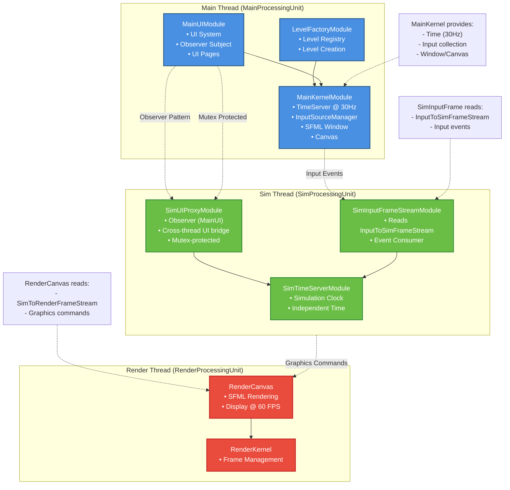

# Module Dependencies Diagram

This diagram shows the module dependencies within each processing unit and the cross-thread communication patterns:

- **Main Thread Modules** (blue) - UI, level management, input collection
- **Render Thread Modules** (red) - Frame rendering and canvas management
- **Sim Thread Modules** (green) - Simulation logic, time, and input processing

[← Back to Architecture Overview](../architecture.md)
