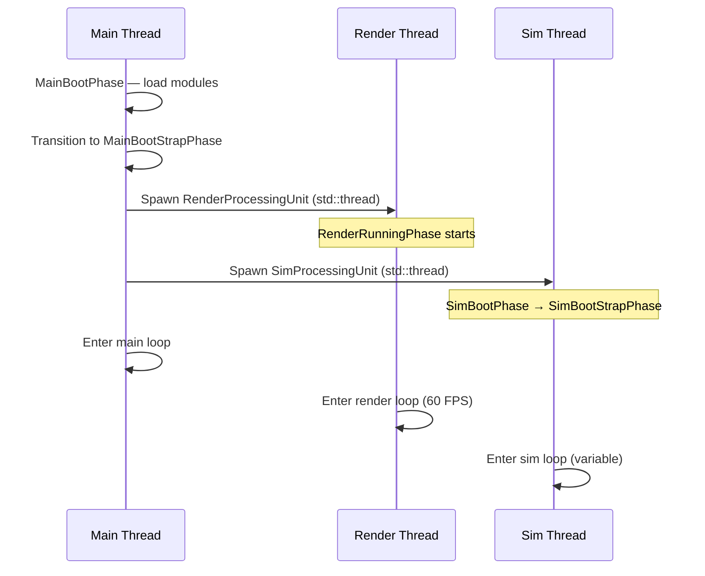
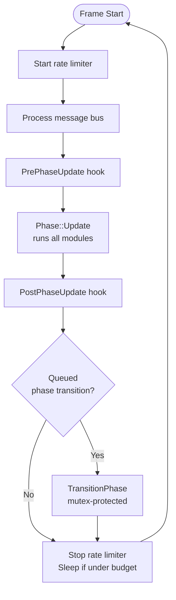

# Frame Lifecycle

Cluiche runs three independent threads — Main, Render, and Sim — each with its own update loop and frame rate. They communicate exclusively through **FrameStreams**: thread-safe ring buffers that decouple the producer from the consumer so neither thread stalls waiting for the other.

---

## The Three Threads

| Thread | Rate | Responsibility |
|---|---|---|
| **Main** | ~30 Hz | Window, input collection, UI system, thread lifecycle |
| **Render** | 60 FPS (locked) | Read latest frame data, issue draw calls, display |
| **Sim** | Variable (30–120 Hz) | Game logic, physics, build frame data for render |

None of these threads calls into the others directly. All cross-thread data moves through FrameStreams.

---

## Startup Sequence

Main thread starts first, then spawns the other two:



The two FrameStream references — `InputToSimFrameStream` and `SimToRenderFrameStream` — are passed to the Render and Sim PUs at spawn time. After that, the threads never share pointers directly.

---

## Per-Frame Update Loop

Every `ProcessingUnit` runs the same base loop:



`PrePhaseUpdate` and `PostPhaseUpdate` are where each thread's thread-specific work happens — the base loop doesn't know about rendering or simulation.

---

## What Each Thread Does Per Frame

=== "Main (~33 ms budget)"

    **PrePhaseUpdate:** nothing

    **Phase::Update** (MainBootStrapPhase modules):

    - Poll OS window events
    - Write input events to `InputToSimFrameStream`
    - Tick the UI system (web view)

    **PostPhaseUpdate:** nothing

    Main sleeps the remainder of its 33 ms budget via `TimeThreadLimiter`. It exists to own the window handle and feed input — it is not on the critical path for gameplay or rendering.

=== "Render (~16.7 ms budget)"

    **PrePhaseUpdate:** nothing

    **Phase::Update** (RenderRunningPhase modules): nothing substantial

    **PostPhaseUpdate** — this is where rendering actually happens:

    ```cpp
    pFrame = mFrameStream->FetchLatestData(timestamp);
    if (pFrame) {
        mpCanvas->StartFrame(*pFrame);    // Clear buffers
        mpCanvas->ProcessFrame(*pFrame);  // Execute draw commands
        mpCanvas->EndFrame(*pFrame);      // Swap / display
        mFrameStream->GarbageCollectAllFramesOlderThan(timestamp);
    }
    ```

    `FetchLatestData` takes a lock, grabs the newest frame in the buffer, and returns immediately. If Sim is slow and hasn't produced a new frame, Render re-displays the previous one — no stall.

    Render sleeps the remainder of its 16.7 ms budget. 60 FPS is maintained regardless of Sim speed.

=== "Sim (variable budget)"

    **PrePhaseUpdate:**

    - Clear `mRenderFrameBuffer` (reset draw command list)

    **Phase::Update** (SimBootStrapPhase / test stage modules):

    - Read input from `InputToSimFrameStream`
    - Tick physics, game logic, animations
    - Call `mRenderFrameBuffer.RequestDraw(...)` to build draw commands

    **PostPhaseUpdate:**

    ```cpp
    mSimToRenderFrameStream->InsertCopyOfDataToStream(
        mRenderFrameBuffer,
        timeModule->GetTimeServer().GetTime());
    timeModule->Tick();
    ```

    Sim has **no rate limiter**. It runs as fast as the work allows. If a frame takes 5 ms, it immediately starts the next. If it takes 40 ms, Render just shows the previous frame twice — no dropped render frames.

---

## FrameStream: How Cross-Thread Data Moves

`FrameStream<T>` is a timestamped ring buffer with an internal mutex:

```cpp
template <class T>
class FrameStream {
    mutable std::mutex mMutex;
    std::deque<InternalData> mFrameList;   // 10–20 frames buffered

public:
    // Producer side (Sim writes render data; Main writes input)
    void InsertCopyOfDataToStream(const T& data, const TimeAbsolute& timestamp);

    // Consumer side (Render reads latest; Sim reads input)
    const T* FetchLatestData(TimeAbsolute& outTimestamp) const;
    const T* FetchDataClosestToTime(const TimeAbsolute& t, TimeAbsolute& outTimestamp) const;

    // Cleanup (call from consumer side to bound buffer growth)
    void GarbageCollectAllFramesOlderThan(const TimeAbsolute& timestamp);
};
```

The key design decision: the consumer **never blocks waiting for new data**. `FetchLatestData` returns the most recent available frame, which may be several frames old if the producer is slow. This is what allows Render to run at a locked 60 FPS even when Sim is under load.


---

## Frame Timeline (Ideal Case)

```mermaid
gantt
    title One 33ms window (Main frame budget)
    dateFormat  x
    axisFormat  %L ms

    section Main (30 Hz)
    Collect input + push to stream :a1, 0, 5
    UI tick                        :a2, 5, 15
    Sleep                          :a3, 15, 33

    section Render (60 FPS — two frames fit)
    Fetch frame + draw (frame A)  :r1, 0, 16
    Fetch frame + draw (frame B)  :r2, 17, 33

    section Sim (variable)
    Read input + tick logic       :s1, 0, 12
    Build + push FrameData        :s2, 12, 18
    Read input + tick logic       :s3, 18, 28
    Build + push FrameData        :s4, 28, 33
```



Two Render frames and (up to) two Sim frames can complete within one Main frame. Render and Sim execute concurrently — Sim frame N+1 can be in progress while Render is displaying Sim frame N.

---

## Phase Transitions

Phases cannot be switched mid-frame. `QueuePhaseTransition()` places the new phase ID in a mutex-protected queue; the base loop drains the queue at the end of each frame:

```cpp
{
    std::lock_guard<std::mutex> lock(mQueuedTransitionMutex);
    if (mQueuedTransition.Size() != 0) {
        TransitionPhase(mQueuedTransition[0]);
        mQueuedTransition.RemoveAt(0);
    }
}
```

This means a module calling `QueuePhaseTransition()` inside `Update()` won't see its new phase until the next frame — safe across threads.

**Phase sequences:**

```
Main:   MainBootPhase → MainBootStrapPhase  (stays here until shutdown)
Render: RenderRunningPhase                  (single phase, runs until join)
Sim:    SimBootPhase  → SimBootStrapPhase   (→ game stage phases)
```

---

## Simulation Time

Sim has its own clock — `TimeServer` — that advances independently of wall-clock time:

```cpp
class TimeServerModule : public Module {
    TimeServer mTimeServer;   // Tracks sim-time in fixed steps
public:
    void Tick();              // Advance by 1/Hz seconds (default: 1/30)
};
```

Sim-time is used to timestamp frames pushed to `SimToRenderFrameStream`. Render uses those timestamps to garbage-collect frames older than the one it just displayed.

Because Sim-time is decoupled from wall time, it can be paused, scaled, or rewound — none of those operations affect the render or main loops.

---

## Shutdown

When Main stops, it joins the other threads in order:

```cpp
void MainProcessingUnit::PrePhaseStop() {
    mSimThread->join();     // Wait for Sim to finish current frame
    mRenderThread->join();  // Wait for Render to finish current frame
}
```

Sim and Render check `FlaggedToStopUpdating()` at the top of each frame and exit cleanly. No forced termination.

---

## Thread Safety Rules

| Pattern | Safe? | Notes |
|---|---|---|
| Push to FrameStream from one thread | ✅ | Internal mutex |
| Read FrameStream from one thread | ✅ | Internal mutex |
| Read and write FrameStream concurrently | ✅ | Internal mutex serialises |
| `QueuePhaseTransition()` from any thread | ✅ | Mutex-protected queue |
| `TransitionPhase()` directly | ⚠️ | Only safe from the owning thread |
| `Transform2D` hierarchy traversal | ❌ | Not thread-safe; known issue |
| `ObserverSubject::Notify()` | ✅ | Internal mutex |

---

## See Also

- [Threading Model](threading-model.md) — deeper coverage of synchronisation mechanisms and known issues
- [Module System](module-system.md) — how modules attach to phases and declare dependencies
- [Asset Journey](asset-journey.md) — how assets loaded at runtime connect to the frame draw commands Sim produces
