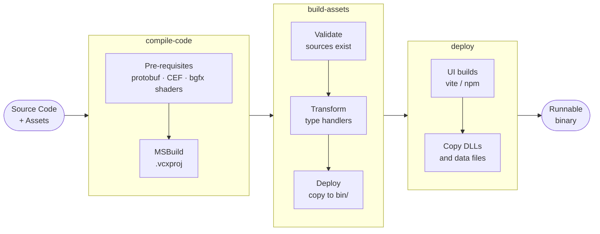
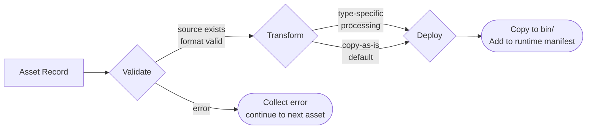

# Pipeline Guide

The Dia pipeline is a **3-stage build system** that compiles code, processes game assets, and deploys runtime files before an executable can run. It replaces the scattered `.vcxproj` post-build events that used to do this work.

```
dia run <target>       =  dia pipeline --target <target>  +  dia launch <target>
dia pipeline --target  =  compile-code → build-assets → deploy
dia launch <target>    =  execute only (no build)
```

---

## The Three Stages



All configuration lives in `pipeline.toml` at the repo root. Each target (`cluichetest`, `googletest`, `cluicheeditor`) declares which stages it needs and what files to copy.

---

## Stage 1: compile-code

Builds everything the compiler needs before running MSBuild.

### Pre-requisites

Some targets have **build dependencies** that must exist before MSBuild runs. These are declared per-target in `pipeline.toml`:

```toml
[targets.cluichetest.build_deps]
protobuf = true       # Generate C++ from .proto files
cef_wrapper = false   # Build libcef_dll_wrapper.lib via CMake
bgfx_shaders = true   # Compile HLSL/GLSL shaders via shaderc
```

Each pre-requisite uses a **sentinel file** so it only runs once per environment:

| Pre-requisite | Input | Output | Sentinel |
|---|---|---|---|
| protobuf | `Dia/DiaDebugProtocol/proto/*.proto` | `proto/generated/*.pb.h/.cc` | `.diaenv/proto/*.sentinel` |
| cef_wrapper | CEF binary distribution | `External/CEF/lib/{Config}/libcef_dll_wrapper.lib` | File existence |
| bgfx_shaders | `Dia/DiaBgfx/Shaders/**` | `bin/.../assets/shaders/` | Shader file timestamps |

### MSBuild

After pre-requisites, MSBuild compiles the target's `.vcxproj`:

```
msbuild <target>.vcxproj /p:Configuration=Debug /p:Platform=x64 /m:2
```

`/m:2` means two parallel compilation jobs. The timeout is 30 minutes.

---

## Stage 2: build-assets

Turns source assets into deployable runtime files. This stage reads a **source catalogue**, processes each asset, and writes a **runtime manifest** the game uses at startup.

### Two Manifests

| Manifest | Location | Purpose |
|---|---|---|
| `assets.catalogue.json` | `Cluiche/Assets/<App>/` | Source of truth — full metadata, source paths, hashes |
| `assets.runtime.json` | `bin/<App>/<Config>/x64/assets/` | Deployed — lean format with deploy paths only |

The catalogue is authored by the DiaAssetCatalogueEditor tool. The runtime manifest is generated fresh each pipeline run.

### The Asset Record

Every asset in the catalogue has:

```json
{
    "id": "texture.player_ship",
    "type": "texture",
    "source_path": "Assets/CluicheTest/Characters/player_ship.texture.png",
    "scope": "stage",
    "stage_name": "Gameplay",
    "tags": ["characters"]
}
```

- **`scope`** — `global` (shared across all stages) or `stage` (belongs to one stage)
- **`tags`** — drive the deploy directory layout (see below)
- **`stage_name`** — which stage owns this asset when `scope=stage`

### Validate → Transform → Deploy

Each asset type has a **handler** that runs three phases:



!!! note "Validation collects all errors before stopping"
    The pipeline doesn't stop at the first broken asset. It validates everything, then reports all failures together so you can fix them in one pass.

**Built-in handlers:**

| Type | Transform | Notes |
|---|---|---|
| `texture`, `sprite` | Copy as-is | Validates PNG/JPG |
| `entity`, `config` | Copy as-is | Validates JSON schema |
| `stage` | Copy as-is | Validates `.diastage` format |
| `folder` | Recursive copy | Entire directory tree preserved |
| `mesh3d` | glTF → `.mesh3d` | Cooking step: binary format for runtime |
| `audio` | Copy as-is | Validates audio file |

### Deploy Layout

Where a file lands in `bin/` depends on `scope` and `tags`:

```
bin/CluicheTest/Debug/x64/assets/
├── global/                    ← scope=global assets
│   ├── Presentation/UI/
│   ├── characters/
│   ├── gameplay/
│   └── misc/
└── stages/                    ← scope=stage assets
    ├── Gameplay/
    │   ├── characters/        ← tag=characters
    │   └── gameplay/
    └── MainMenu/
        └── Presentation/UI/
```

Tag priority (first match wins): `Presentation/UI` → `Presentation` → `characters` → `environments` → `gameplay` → `misc`.

---

## Stage 3: deploy

Copies everything the binary needs at runtime that isn't produced by MSBuild or the asset pipeline.

### UI Builds

If the target has a UI frontend (e.g. CluicheEditor's React app), deploy runs the build first:

```toml
[targets.cluicheeditor.deploy]
ui_builds = [
  { cwd = "Cluiche/CluicheEditor/UI", cmd = "node node_modules/vite/bin/vite.js build" }
]
```

The built output is then copied to `bin/` alongside the binary.

### File Copy Rules

```toml
[targets.cluichetest.deploy]
files = [
  { src = "External/SFML/Current-x64/bin/sfml-window-3.dll", dest = "$(OutDir)" },
  { src = "Cluiche/Assets/CluicheTest/cluichetest.diagame",   dest = "$(OutDir)assets/" },
]
```

`$(OutDir)` expands to `Cluiche/bin/<AppName>/<Config>/x64/`. Glob patterns (`*`, `**`) are supported. `**` preserves relative directory structure; `*` copies flat.

Files are only copied if the source is newer than the destination — deploy is incremental.

### Auto-derived .diastage rules

If a `.diagame` file is in the deploy rules, the pipeline reads its `imports` array and automatically adds a deploy rule for every imported `.diastage` file. You don't need to list each stage manually.

---

## Checkpoint System

The pipeline tracks completed stages in a checkpoint file:

```
Cluiche/out/DiaCLI/logs/pipeline/checkpoint.<target>.<config>.json
```

If a run fails mid-way (e.g. build-assets crashes), re-running picks up from the last successful stage rather than starting over. Use `--force` to clear the checkpoint and re-run everything.

---

## Common Commands

```bash
# Full pipeline (compile + assets + deploy) for cluichetest
dia pipeline --target cluichetest

# Release build
dia pipeline --target cluichetest --config Release

# Run specific stages only
dia pipeline --target cluichetest --stage compile-code,deploy

# Force re-run even if checkpoint says already done
dia pipeline --target cluichetest --force

# Build + run in one step
dia run cluichetest

# Run without rebuilding (already built)
dia launch cluichetest
```

---

## Which Stages Does Each Target Need?

Not every target needs every stage. `googletest` has no assets; `cluicheeditor` skips reflect.

| Stage | cluichetest | googletest | cluicheeditor |
|---|---|---|---|
| compile-code | ✅ | ✅ | ✅ |
| reflect | ✅ | — | — |
| build-assets | ✅ | — | ✅ |
| deploy | ✅ | ✅ | ✅ |

Configure this in `pipeline.toml`:

```toml
[targets.googletest]
stages = ["compile-code", "deploy"]

[targets.cluichetest]
stages = ["compile-code", "reflect", "build-assets", "deploy"]
```

---

## Adding a New Asset Type

1. Create a handler class implementing `AssetHandler` in `Dia/DiaCLI/dia_cli/commands/asset/handlers/`
2. Register it in the handler registry
3. Add the `type` string to `assets.catalogue.json` records

For copy-as-is types (no transform needed), the default handler works without any code — just add assets to the catalogue with the right `type`, `scope`, and `tags`.

---

## See Also

- [Asset Journey](asset-journey.md) — how an asset travels from file to runtime object in C++
- `pipeline.toml` — the configuration file for all pipeline targets
- `Cluiche/Assets/<App>/assets.catalogue.json` — the source asset manifest
