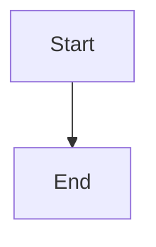

# Documentation Viewer Setup

## Overview

A polished documentation viewer has been set up using **MkDocs Material**. Your existing markdown files are rendered with professional navigation, search, and Mermaid diagram support.

## Quick Start

### Windows
```bash
docs-serve.bat
```

### Linux/Mac
```bash
./docs-serve.sh
```

Then open your browser to: **http://127.0.0.1:8000**

## Features

✅ **Material Design Theme** - Professional, responsive layout with light/dark mode
✅ **Instant Search** - Full-text search with suggestions and highlighting
✅ **Mermaid Diagrams** - All 5 architecture diagrams render natively
✅ **Code Highlighting** - Syntax highlighting with copy buttons
✅ **Navigation** - Hierarchical sidebar matching your directory structure
✅ **Hot Reload** - Automatically refreshes when you edit markdown files

## Project Structure

```
C:\GitHub\Cluiche\
├── docs/                    # Your markdown source files (unchanged)
├── mkdocs.yml              # MkDocs configuration
├── requirements.txt         # Python dependencies
├── venv/                   # Python virtual environment
├── site/                   # Generated HTML (gitignored)
├── docs-serve.bat          # Windows: Start server
├── docs-serve.sh           # Linux/Mac: Start server
└── docs-build.bat          # Windows: Build static site
```

## Usage

### Start the Server
```bash
# Windows
docs-serve.bat

# Linux/Mac
./docs-serve.sh

# Or manually
venv\Scripts\activate  # Windows: venv\Scripts\activate
mkdocs serve
```

The server runs at **http://127.0.0.1:8000** and auto-reloads when files change.

### Build Static Site
```bash
# Windows
docs-build.bat

# Or manually
venv\Scripts\activate
mkdocs build
```

Output is generated in `site/` directory.

### Stop the Server
Press `Ctrl+C` in the terminal where `mkdocs serve` is running.

## Authoring Workflow

**Nothing changes!** Continue editing your markdown files as before:

1. Edit any `.md` file in `docs/`
2. Save the file
3. Browser automatically refreshes with changes

### Adding New Files

1. Create your new `.md` file in `docs/`
2. Add it to the `nav` section in `mkdocs.yml`

Example:
```yaml
nav:
  - New Section:
    - My Page: path/to/my-page.md
```

### Mermaid Diagrams

Embed Mermaid diagrams directly in markdown:

````markdown

````

## Configuration

Edit `mkdocs.yml` to customize:
- Site name and description
- Navigation structure
- Theme colors (`primary` and `accent`)
- Features (search, navigation, etc.)
- Additional plugins

## Current Status

✅ **MkDocs Material 9.7.6** installed
✅ **Mermaid plugin** configured
✅ **Navigation structure** created for existing docs
✅ **5 Mermaid diagram wrappers** created in `docs/reference/architecture/diagrams/`
✅ **Server running** at http://127.0.0.1:8000

⚠️ **Warnings**: Some files referenced in nav don't exist yet (expected - docs are 72% complete per DOCUMENTATION_TODO.md). These files will appear in nav once created.

## Dependencies

All dependencies are in `requirements.txt`:
- mkdocs>=1.5.0
- mkdocs-material>=9.5.0
- mkdocs-mermaid2-plugin>=1.1.0
- pymdown-extensions>=10.7.0

## Troubleshooting

### Virtual Environment Issues
```bash
# Recreate virtual environment
rm -rf venv
python -m venv venv
venv\Scripts\activate  # Windows
pip install -r requirements.txt
```

### Port Already in Use
```bash
mkdocs serve -a 127.0.0.1:8001  # Use different port
```

### Broken Links
The warnings about missing files are expected - they reference documentation that hasn't been written yet (see DOCUMENTATION_TODO.md). They'll disappear as you complete the documentation.

## Next Steps

1. ✅ **View your docs**: Open http://127.0.0.1:8000
2. ✅ **Test navigation**: Click through sections
3. ✅ **Test search**: Try searching for "ProcessingUnit"
4. ✅ **View diagrams**: Check `Architecture` → diagrams
5. ✅ **Test hot reload**: Edit a markdown file and watch it update

## Notes

- **Localhost only**: This runs on your local machine only (not deployed)
- **Git**: `site/` and `venv/` are gitignored
- **Source files**: Your original `.md` files are unchanged
- **Portable**: All files relative to repository root
